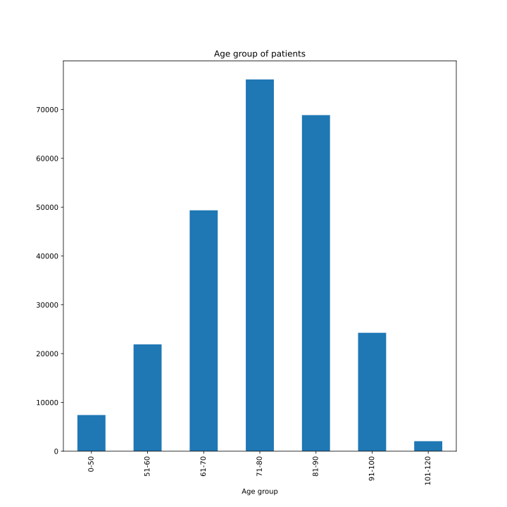
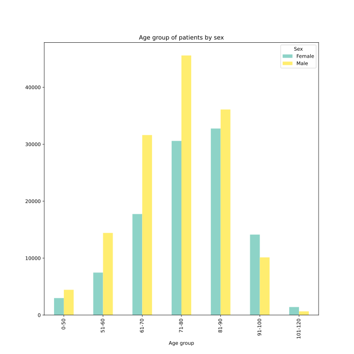
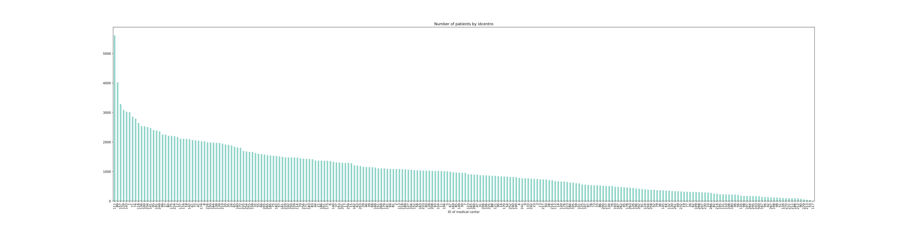
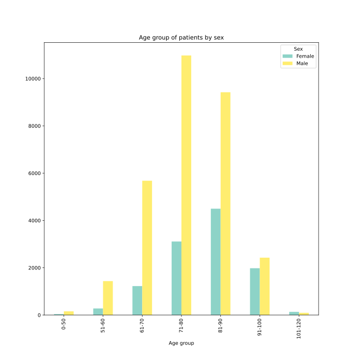
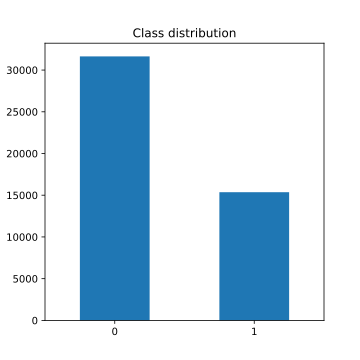

# Machine Learning Project 2022/23

### **Abstract**

In this project, we focused on enhancing cardiovascular risk
prediction of diabetic patients using recurrent neural networks and
transformer models with data provided as electronic health records
(EHRs). Existing systems often grapple with challenges like data
sparsity, diverse event values, inconsistent standards, and data entry
errors. To surmount these complexities, our strategy involved
cleaning, repairing, and deleting those errors trying to keep the
majority of patient records. Moreover, we leverage the enormous
capabilities of a specialized LLM like PubMedBERT to provide insight
into the history of patients transformed from cleaned EHRs into
textual representations, achieving good results.

# **1** **Introduction, context, and motivations**

In recent years, the healthcare industry has witnessed a profound
transformation driven by the widespread adoption of electronic health
records (EHR). These digital databases have revolutionized the way
health-care information is collected, stored, and accessed. EHR systems
have made health information available to authorized users, marking a
significant departure from traditional paper-based medical records. This
digital revolution has opened up new opportunities for leveraging
artificial intelligence (AI) to extract valuable insights and enhance
patient care.

## **1.1** **Motivation**

The advent of EHR systems has paved the way for the development of
various AI-based applications designed to harness the wealth of data
contained within these records. These applications span a wide range of
functionalities, from supporting caregivers in prognostics and
diagnostics to facilitating the extraction of exam results, patient
subtyping, and therapeutic paths. AI algorithms have been deployed to
suggest personalized therapies, predict the risk of complications, and
perform numerous other tasks aimed at improving the health of patients
and healthcare delivery.

## **1.2** **The Promise of Deep Learning**

Among the various AI techniques that have been applied to EHR data, deep
learning (DL) algorithms have gathered significant attention. These
neural network-based approaches have demonstrated remarkable potential
for prediction from EHR data. DL models have the capacity to uncover
complex patterns, relationships, and trends, offering the irresistible
prospect of more accurate and timely healthcare interventions.

## **1.3** **Challenges and Limitations**

Despite the growing body of research in this field and the promising
results achieved by DL algorithms, there are problematic challenges that
must be addressed to fully unlock the potential of AI in healthcare.
State-of-the-art systems, while impressive, are still fighting with
numerous sources of complexity inherent to EHR data.

- **Data Sparsity**: EHR data often suffer from missing or incomplete
information, leading to data sparsity issues that can hinder the
performance of AI models.

- **Lack of Standards**: The absence of uniform data standards across
healthcare systems makes it challenging to integrate and analyze EHR
data from diverse sources.

- **Latent Temporal Dependencies**: Healthcare data inherently exhibit
temporal dependencies that are not always explicitly represented,
posing challenges for predicting future outcomes accurately.

- **Irregular Time Intervals**: EHR data entries do not always occur
at fixed time intervals, introducing irregularities that require
sophisticated modeling.

- **Errors and Inconsistencies**: Inaccuracies in data entry
processes, as well as inconsistencies in terminology and coding, can
introduce noise into the data and impact model performance.

- **Absence of Precise Interpretability**: While DL models can provide
powerful predictions, their inherent complexity often makes it
difficult to interpret the rationale behind their decisions, which is
crucial in healthcare settings.

## **1.4** **Objectives**

This project aims to address these challenges and limitations by
developing DL-based solutions for the prediction of cardiovascular
events from EHR data. We seek to create robust and reliable models that
can ensure to healthcare practitioners more knowledge and understanding
of the generated predictions. We have detailed the methodology and model
architectures proposed in this project, explaining how we address the
challenges and reporting the evaluation metrics used to assess the
performance of our models.

# **2** **Dataset description**

The project utilizes a dataset consisting of **Electronic Health
Records** (EHRs) from 250,000 patients, collected by "**Associazione
Medici Diabetologi**" (AMD)[^3]. Our data was
gathered from 234 different diabetes treatment centers from various
regions of Italy and encompasses a wide range of patient information:
medical history, treatment records, drug prescription, and demographics.

Within the dataset, various tables contain specific details related to
patients, for example, the "*anagraficapazientiattivi*" table includes
personal information like age, sex, education, profession, ethnicity,
and marital status.

 

Figure 1: Number of diabetic patients by age

From the data shown in Figure 1, it is evident that there is a
significant imbalance in patient age. The majority of patients fall
within the age range of 71-90, spanning two decades and accounting for
nearly 60% of the dataset. Additionally, if we extend the age range to
61-90, the percentage of the dataset coming from this group reaches
almost 80%. This leaves young people underrepresented in the dataset.

 

Figure 2: Number of diabetic patients by age and sex

Based on the data depicted in Figure 2, it is quite apparent that there
is a noticeable imbalance present within the dataset. Specifically, the
number of male patients is significantly greater compared to the female
patients, who are considerably underrepresented.

As we can see from Figure 3 some medical centers registered more
patients than others in very different orders of magnitude and this
gives us the long-tailed distribution that we can observe.

 

Figure 3: Number of diabetic patients registered in each medical center

The "*diagnosi*" table offers insights into the conditions of diseases
diagnosed in the patients and when they are diagnosed. Figure 4 shows
that some diagnoses are prevalent among patients and others are less
frequent, this indicates the possibility for a medical expert to make
some type of diagnosis more fine-grained than others to improve the
quality of the dataset in the future.

 

Figure 4: Number of diabetic patients by codiceamd

The "*esamilaboratorioparametri*" table includes details of laboratory
tests and medical analysis with their values; additionally, the
"*esamistrumentali*" table provides information about medical tests such
as EMG, ECG, echocardiography, eye examination, retinography, blood
pressure control, OCT, etc; and the
"*esamilaboratorioparametricalcolati* table tells information about
values of cholesterol, BMI and GFR (CKDEpi). All these exams show
various types of distributions, we show them inside the plot.ipynb file
for those who are interested in more details.

The "*prescrizionidiabetenonfarmaci*" table documents assigned diets and
blood glucose controls for patients; moreover, the
"*prescrizionidiabetefarmaci*" table contains records of prescribed
diabetes drugs; while the "*prescrizioninondiabete*" table contains
prescriptions for other types of non-diabetes medications.

One of the primary challenges faced during the project was handling data
quality problems that arose due to inconsistencies and errors in the
data collection process. Since the data was collected over a long period
from various sources that used different versions of EHR software,
semantic differences emerged. This required extensive data cleaning and
preprocessing to ensure data consistency and enable meaningful analysis.

# **3** **Task 1 description**

The completion of the task involves **preparing** and **pre-processing**
the tables in the dataset, focusing solely on active patients with
cardiovascular events. To manage the large volumes of data we have used
a **parallel approach** when loading the tables from csv and converting
them into **pandas dataframes**.

The first step is performed by converting the dates into the appropriate
data types and joining the master data with the diagnosis to identify
patients with at least one **cardiovascular event** in their medical trajectories.

After that, the task involves **cleaning invalid features**,
scrutinizing date and time intervals to ensure there are no
inconsistencies in birth and death years, verifying the logical
consistency of events: occurring before a patient's birth or after a
patient's death, and taking the appropriate action to resolve them, such
as repair these type of errors when possible and delete them when not.

Following that, patients with all dates in the same month are removed
from the dataset, as the focus is on patients with **extended
histories** of medical examinations and diagnosis, so we have filtered
them in **two ways** by the use of a flag: by the examination and
diagnosis table only and also by adding the prescriptions because the
latter are considered as only minor events that contribute in a minimum
part to the medical trajectory of a patient (experimentally we have
found little or no difference between the two modality). To handle the
**vast amount of data** necessary to perform this filtering, we have
opted to create a single dataframe with all the dates, then on it
performs some **grouping and aggregation** to extract the max and min
values of date by a patient, and also having a clue on the range present
inside the part of the dataset of our interest, we have found that the
**trajectory is highly variable** and span from patients that have all
events in one day to patients that have about one hundred years of
trajectory.

The ranges of "esamilaboratorioparameteri" and
"esamilaboratorioparametericalcolati" are modified according to the
specifics to **clip** their values in a more descriptive range and
**delete errors of measurement and outliers**. Since the specifics have
some ranges to "Not available" we have interpreted this advice as not
touching those values instead of another possible interpretation of
removing them, this is because of our lack of medical knowledge in the
field.

Selection and **label definition** are performed by using only patients
who, after undergoing the previous steps, have at least two events (also
here event is intended in two ways: as a diagnosis or an examination
only, and with added prescriptions) in their trajectory. The label
calculation is based on whether a patient has, in all the diagnoses, a
cardiovascular event within 6 months before the date of their last event
or not. After that, all patients with a trajectory shorter than or equal
to 6 months are removed.

Finally, an additional step involves considering other **cleaning
strategies** to enhance the dataset's quality. We have opted to measure
the quality by the number of null values that we are able to fill
without having to drop that information and those numbers are measured
both before and after implementing these filling, cleaning and dropping
strategies to evaluate their effectiveness in improving the dataset's
overall **reliability**.

An analysis of patient demographic information was performed, such as
marital status, level of education, profession and origin. A high
presence of null values was observed within these columns, so we have
opted to delete the information about the origin since it was 99%
unknown, instead, the other columns were maintained also if they were
full of null values in the order of less than 70% but we have opted to
delete the least amount of information when possible and assign a
placeholder when we don't know it. The column type of diabetes was
deleted since it was the same value for all the patients, and we have
adopted some filling strategies on the year of diagnosis of diabetes and
year of first access.

In exam tables, all improvements in data quality consist of filling with
the most appropriate strategy based on the values of the data already
present inside the dataset. Instead in prescription tables, we have
adopted a statistical filling strategy for the null values based on the
probability of finding a value in that column for the specific code,
assigning more weight to the most common values and less weight to fewer
ones.

By meticulously completing these action items, the dataset was refined,
ensuring it contains only **relevant, accurate and balanced**
information about active patients, their comprehensive medical histories
and only when not possible some unavoidable unknown values.

 

Figure 5: Number of diabetic patients with cardiovascular events in 6-month period by age and sex.

As we can see from Figure 5 a major concern for the generated models,
and also perhaps a hint for patients to be kept more under observation
in their medical path, is the fact that the distribution of patients by
sex after all the preprocessing steps is unbalanced. The distribution
shows almost 2/3 of male patients versus 1/3 of female patients and
those data exhibit that male patients are more subject to cardiovascular
events with respect to female patients, but moreover, the resulting
models generated from this dataset can be subject to **bias** and
**ethical concern**, since it may be the case that the recognition of a
female patient's illness is less accurate than a male patient's.

Figure 6: Number of diabetic patients with cardiovascular events in 6-month period class distribution.

The distribution of the dataset is imbalanced, showing a notable
difference in the number of patients who experienced cardiovascular
events within the six-month timeframe, as depicted in Figure 6. This
uneven spread has the potential to introduce other biases into the model
in addition to the previous one and could influence how well the models
perform. Hence, it is vital to confront this problem and create suitable
methods for lessening the effects of the imbalanced classes, as we have
done in the following section.

Analyzing the meaning of the data, i.e., nearly one in three patients
has a cardiovascular event in the limited timeframe defined by the
specifications of the project, and at the previous proportions, those of
the entire registry compared to patients with cardiovascular problems,
i.e. 1 to 5, we would have expected a stronger or approximately similar
imbalance to latter. Therefore, we consider this result, although
positive for the quality of the dataset, unexpected given the initial
premises.

# **4** **Task 2 description**

The task involved addressing the issue of class imbalance within the
dataset created in the previous task. As the dataset contained an uneven
distribution of classes, the main objective was to balance it to ensure
an equal representation for both classes.

## **4.1** **Dataset Balancing**

To rectify the class **imbalance** caused by the uneven occurrence of
cardiovascular events within the six-month period as we can see from
Figure 6, a two-fold strategy was implemented. For the instances where
patients did not experience a cardiovascular event in the six-month
period (the 0 label), the last six months, from the last event, of their
medical history were removed, this is to prevent the model from
receiving unintentional hints of the future. Conversely, for patients
with a cardiovascular event (the 1 label) only cardiovascular events
occurring in the last six months were eliminated, so only the
table"diagnosi" was affected for the positive patient. Then to
**balance** the dataset multiple copies of the data were generated by an
integer factor representing the ratio of the minority class over the
majority class. Within each copy, the events were randomly shuffled by
adding a noise function sampled from a random distribution of mean 0 and
sigma of 5. The copied events are also randomly deleted by an amount
factor specified by a float value in the range \[0,1\], where 0
represents do not keep events and 1 represents keep all events. This
approach contributed to balancing the dataset, effectively addressing
the class imbalance by augmenting the minority class instances.

Subsequently, an evaluation process was conducted involving three
distinct models: vanilla-LSTM, T-LSTM, and PubMedBERT. This evaluation
was performed on the balanced version of the dataset. The purpose of
this evaluation was to compare different models' performance and
highlight the effectiveness of the balancing approach.

## **4.2** **PubMedBERT**

From the work of Gu et al. (2021)[^4] that released a pre-trained model of
**PubMedBERT**, we employed the AutoModelForSequenceClassification
module found in the **Huggingface Transformers** library. This model
possesses its pre-trained weights designed for language modeling of
medical research papers written in English and obtained from the PubMed
archive. In our approach, we converted a patient's history of events
into a unified string using various regex to delete all unwanted
information. This conversion involved translating all the table and
column names to English, substituting **AMD codes** with their
corresponding meanings and **ATC codes** with their respective
ingredients' names, followed by the associated values.

An inherent limitation of this model is its capacity to process a
maximum of 512 input tokens, instead, a patient's medical history can be
more than 60 times longer. To tackle this challenge, we opted to input
only the patient registry and the representation of the most recent
events, sorting them by date and by our custom importance of tables
(diagnosis, exam and lastly prescriptions).
AutoModelForSequenceClassification is a wrapper class that allows
utilizing the pre-trained PubMedBERT attaching a **fully connected
layer** of the size of the number of classes to detect (in our case 2
neurons) and **fine-tune** the model on our task.

To speed up the training of the PubMedBERT model we utilized the
**pytorch-lightning** library that allowed us to reduce the amount of
boilerplate training code and ensure the presence of tensor on the same
hardware device avoiding losing time in the useless transfer of data
between GPU and CPU. The Trainer class of lightning allows the **reduction of memory consumption** and
the **increase of computation resources**, by utilizing an appropriate
flag that reduces the floating point operation to 16-bit precision when
possible, in this way, we can use the same hardware to perform a single
32-bit operation to execute two operations with a speedup of
computation of about two times.

The results obtained with the fine-tuned PubMedBERT model on our
balanced dataset show an **accuracy** of **99.5%** and a **binary
f1-score** of **99.4%** on the validation split of the dataset, after 5
epoch of training the entire model. We are concerned about this high
result in the score and we think this is due to the less aggressive type
of cleaning we have adopted in the cleaning phase of task one that gave
us an imbalance of 1 to 2 of the minority class, giving us a more simple
task or more enlarged data with respect to the more narrowly defined
policies.

## **4.3** **Vanilla LSTM**

We employed also a **LSTM** Hochreiter and Schmidhuber (1997)[^5], a
**Recurrent Neural Network**. To provide a useful representation of data
for its input, the first step was converting each categorical feature to
float, for example by associating an enumeration of integers with the
AMD code. Since there are both numeric and categorical values in the
"value" feature, we proceeded with the conversion to numerical values of
the categorical ones whose meaning was known and interpretable, this is
the case of "S/N" which stands for positive and negative response. To
avoid the loss of crucial information, columns have been defined to
encode the dataset of origin of an event, preventing the loss of this
information of a merge, and subsequently allowing the model to
distinguish events of different natures such as diagnoses, exams and
prescriptions and the different types of exams and prescriptions (such
as laboratory, calculated, etc.).

Two tensors were constructed: one containing the associated label value
for each patient and the other holding any event in his clinical
history, ordered by the date of the event. In the end, the associated
dates have been eliminated, to allow the model to not have dependencies
on the exact value of the data, but to have only a dependence on the
past and future events (that can be seen as tokens) in the sequences of
the events given in input to the LSTM. The model was then set up to use
the MSE (Mean Squared Error) as a loss function, and the dataset was
split into train, test and validation.

To optimize the computation the maximum size of the tensors was reduced
to the maximum power of two less than the longest patient history
contained in the dataset, at this point in the project. It was estimated
that this upper bound should not have a significant impact as it only
affected the information about 8 patients. The model was trained for a
total of 5 epochs, with a hidden state value of 512 and a number of
layers equal to 2. In this dataset it was possible to provide
information about the dates relating to the patient's registry, such as
the year of birth or death, by converting the years into integers, but
not those associated with the events. The model defined in this
paragraph led to a result with an **accuracy** of approximately
**72.76%**, which was affected by the forcibly imposed limits, necessary
to reduce the model training times, in particular all the columns
containing temporal information were removed from the dataset to reduce
the computational resources needed to train the model.

## **4.4** **Time-aware LSTM**

**T-LSTM** Baytas et al. (2017)[^1] is a variation of a classic LSTM that
allows you to handle irregular time intervals in patient records. Since
**time irregularity** is common in many healthcare applications and
frequent admission can be a discriminative factor of serious health
problems, or on the opposite side, if the time interval between two
records is long (months or years), the dependency on the previous record
should not play an active role to predict the new outcome. The T-LSTM
aims to tackle these problems by adjusting the memory content of the
unit, using a **modified memory cell**, taking into account the
difference in time intervals between two consecutive events. The elapsed
time is transformed into a weight using a **time decay function**:
$g(∆t)$, where in our case the monotonically non-increasing function
is $g(∆t) = \frac{1}{log(e+∆t)}$ and $∆t$ is a day interval that can span
large elapsed time.

In the context of patient data, observations are recorded over time, and
the sequence in which these observations occur is crucial for
understanding the patient's health progression. This temporal order
allows the model to capture trends and patterns that develop over time.
To insert this information into our data, we have processed the dataset
to extract the **day intervals** between two consecutive events of a
patient and then packed this information into an appropriate structure.
We have adopted the original implementation of the T-LSTM in
**TensorFlow**. Because of our lack of knowledge of this particular
framework we have provided a minimal working model without any
optimization or improvement. So the implementation wastes a lot of
resources and does not achieve any useful result giving an **accuracy**
of **50%** after 1 epoch of training nothing more than random guesses. We
are aware of the possibility that training more this model could achieve
better performance, but the resources required are too high that we are
unable to do more than this.

## **4.5** **Delta-t**

In response to the challenges posed by the management of date-related
values and with the overarching objective of endowing our models with a
nuanced understanding of the temporal significance of each date in the
context of individual patients, a strategic decision was made to
implement a transformative approach. This approach, devised to mitigate
the complexities associated with temporal data representation, entailed
the substitution of each date entry, excluding the year of birth, with a
delta value. This delta value was computed to represent the patient's
age at the respective temporal line under consideration. The rationale
underlying this data transformation was to cast the temporal information
not in absolute terms but rather in a relational context, relative to
the patient's life course. By embodying the temporal dynamics in the
form of age deltas, we sought to imbue the models with a more nuanced
understanding of the evolving patient trajectory. This subtle shift in
perspective was anticipated to foster improved interpretability and
model performance, thereby surmounting the intricacies and ambiguities
often associated with raw date representations.

The computation of the delta value was defined as the ratio between the
patient's age at the specific temporal event and the highest recorded
age of a patient within the dataset. Notably, this maximum age threshold
underwent a deliberate augmentation, increasing by a factor of 5%,
thereby elevating it from its initial value of approximately 115 to a
more comprehensive range exceeding 120. With this strategic adjustment,
each recorded event now generates an associated delta value confined
within the inclusive range of 0 to 1. Within this bounded interval, the
delta values manifest a continuum, where the value of 0 corresponds to
the patient's year of birth, marking the inception of their temporal
timeline. The gradual progression of delta values within this range
succinctly encapsulates the evolving patient trajectory, rendering it
amenable to linear interpretation.

Following is described the formula of $∆_p(t)$, where p is a fixed
patient and t is a datatime, and k is the constant of increment factor,
so for a fixed 5% increment is equal to 1.05. To apply this equation, it
was first necessary to convert each datatime into a float, where the
unit represents a year.
$$∆_p(t) = \frac{t − (\text{p's year of birth})}{(\text{maximum age registered})* k}$$
The computational demands imposed by the initial LSTM model, as well as
the subsequent delta value-based representation, exceeded the available
computational resources. As a result, a pragmatic decision was made to
forego the inclusion of patient-specific date information within the
personal data records. This strategic omission succeeded in
significantly curtailing the computational cost, reducing it to
approximately 20% of the original computational burden. While this
reduction was necessary due to resource constraints, it is reasonable to
conjecture that the model's performance, under identical
hyperparameters, may be further enhanced with the reintroduction of
patient date information, particularly in conjunction with the
utilization of the delta value.

Notably, our model's performance, as assessed by **accuracy** metrics,
culminated in an improved accuracy rate of **74.29%**. This outcome
serves as empirical evidence that the refinements made to the data
representation, specifically the employment of the delta value-based
approach, have engendered a discernible improvement in model
performance. These enhancements are indicative of the potential gains
that can be unlocked with more extensive computational resources and a
more comprehensive utilization of patient date information, further
underscoring the relevance of temporal data in the modeling process.

# **5** **Task 3 description**

## **5.1** **Macro-events and micro-events**

The primary objective of this task entailed the establishment of a
hierarchical framework to categorize various events, effectively
dividing them into two distinct categories: macro events, which retain a
crucial order-dependent role in predictive modeling, and micro events,
for which temporal sequence holds lesser importance.

In the context of this project, all diagnostic events were classified as
macro events, while tests and prescriptions were designated as micro
events. This categorization was driven by the inherent associations
observed between diagnoses, tests, and prescriptions within the dataset.
Diagnoses emerged as the predominant macro events, given their frequent
and pivotal connection to subsequent tests and prescriptions, making
them more critical for predictive purposes. A consequential aspect of
this categorization strategy involved the selective exclusion of date
information from the micro events. By directing our model's focus toward
the temporal nuances embedded within macro events and abstaining from
incorporating temporal data into micro events, we aim to furnish the
model with a more refined temporal perspective, thereby enhancing its
predictive capabilities.

## **5.2** **GRU with Bayesian Optimization**

In this phase, we have defined a new model, a **GRU** (Gated Recurrent
Unit) Cho, van Merri¨enboer, Bahdanau, and Bengio (2014)[^2], another
Recurrent Neural Network architecture. This choice was made to obtain
data comparable with the results obtained during the previous task with
the LSTMs. A GRU has an architecture very similar to a Vanilla-LSTM but
uses fewer parameters and only two gates. This makes the GRU a
computationally lighter model compared to the LSTM, but with nearly the
same capability or even better: in the literature was experienced having
better performances in long-range dependencies among data.

In this phase, a different cleaning of the dataset was also tested: the
columns containing information regarding the years of the patient's
registry were dropped, with the exception of the year of diagnosis of
diabetes, since this information was assessed that might be more useful
with respect to the other dates, then the drug description was removed
to further reduce computation resources. Another pivotal dimension of
our data preprocessing strategy involved the fusion of columns housing
information pertaining to the "amd code" and "atc code." It is important
to underscore that no micro or macro events within our dataset
concurrently contained both types of information. This prudent merging
of columns was executed to preempt the emergence of null values and
prevent the superfluous proliferation of columns, thereby enhancing
dataset coherence and computational efficiency. Finally, the categorical
information relating to the information on the "value" of an event was
no longer discarded, but each one was represented with a different
integer.

Lastly, a notable transformation was introduced in our approach to
handling categorical information relating to the "value" of an event. In
a marked departure from prior practices, we refrained from discarding
this categorical information. Instead, we opted to represent each
distinct categorical value with a unique integer encoding, thereby
preserving and harnessing the inherent richness of this information for
subsequent analytical and modeling pursuits. This nuanced adaptation,
driven by the recognition of the potential insights latent within
categorical values, further contributes to the holistic refinement of
our dataset in preparation for advanced data analysis and modeling
endeavors\
An extensive **Hyperparameter tuning** was applied to this model to
optimize it, with the aim of finding the best values of the analyzed
hyperparameters. In particular, the tuning was applied to the learning
rate, the number of epochs, the hidden size and the number of layers of
the GRU. The limited resources available reduced the possibility of
finding optimal hyperparameters, and for the same reason, the
hyperparameters' values taken into account must be kept in small ranges.
In a possible continuation of this research work, a more in-depth
analysis could be carried out, but the work analyzed in this report can
already give an idea of the impact of this optimization on the model. To
realize the **Bayesian Optimization** we used **Optuna**, an open-source
automatic hyperparameter optimization framework. We have chosen to
utilize Optuna as our hyperparameter optimization framework due to its
efficiency, flexibility, ability to adapt to a wide range of machine
learning models, ease of usage, and for the small learning curve to
adopt.

The outcome achieved by the ultimate iteration of the model under
scrutiny, as quantified by its accuracy metric, stands at a modest yet
informative **56,89%**. This empirical finding leads us to draw the
inference that a Gated Recurrent Unit architecture, given its relatively
straightforward and uncomplicated design, may not be optimally equipped
to capture the intricate patterns and subtleties embedded within the
dataset that is presently the subject of our investigation.
Concurrently, our analysis unveils a noteworthy revelation concerning
the utility of temporal information stemming from the micro-level events
within the data corpus. It is discernible from the results that while
these micro-events may bear a lesser degree of significance relative to
the macro-events, their inclusion in the modeling process nevertheless
imparts a discernible boost to predictive performance, thereby
underscoring their pragmatic relevance and contribution to the
overarching objective of achieving superior prediction accuracy.

In contrast to the preprocessing approach employed for the LSTM model,
the preprocessing for the current model did not involve the
representation of event characteristics through dedicated columns (such
as those for exams, prescriptions, diagnoses, and their respective
subcategories). Consequently, only the macro-events, specifically
diagnoses, remain distinguishable from the more other events, referred
to as micro-events. The omission of this detailed event information
could potentially have had an adverse impact on the dataset's quality
and on the performance of the model.

## **5.3** **Conclusion**

In conclusion, our project addressed the critical need for improved
cardiovascular risk prediction in diabetic patients by harnessing the
power of recurrent and transformer models. We have shown that raw EHR
records are of poor quality and must go through many stages of
refinement and readjustment to obtain useful input for the various ML
models that are intended to be created. So we demand a better analysis
of those data from experts in the sector.

We have tested various RNN models with different data input strategies
at our disposal. We have leveraged the advanced capabilities of
specialized language models like PubMedBERT to gain valuable insights
into patients' medical histories, transforming the deep-cleaned EHR data
into a raw textual representation, providing the least amount of
boilerplate strings to the model. Our efforts yielded promising results,
paving the road for enhancing healthcare outcomes through the fusion of
state-of-the-art ML techniques and comprehensive EHR analysis.

The research conducted on the treatment and manipulation of temporal
data, particularly pertaining to the representation of date information,
has elucidated the influence that this specific data encoding strategy
can exert upon the overall efficacy and performance of machine learning
models. Consequently, a pivotal facet of the ongoing progression of this
research endeavor is directed toward the meticulous examination and
refinement of date representation techniques. As articulated in previous
sections of this report, it is manifestly evident that augmenting the
computational resources at our disposal holds substantial promise in
terms of optimizing and enhancing the outcomes and predictions generated
by the envisaged models under consideration.

In future work, a more complex model could be proposed, considering the
excellent performance obtained with the utilization of the transformer
architecture of PubMedBERT. Although it appears to be already an optimal
solution, the impact of Bayesian optimization on the model was not
applied in this project so we couldn't observe its full potential. For
the purposes of the project, this model is already enough optimized, and
the application of a Bayesian optimization with the means at our
disposal would hardly have led to observable progress, but we believe
that in a huge setting, this type of optimization can be crucial to lead
to a better generalization. The following models could be possible
solutions to analyze for our use case: BioGPT, Hyperbolic Neural
Network, or Temporal Convolution Network. **BioGPT** in fact presents
similar characteristics to PubMedBERT, being a domain-specific
generative pre-trained transformer language model for biomedical text
mining, it can leverage the power of this architecture that has already
proven beneficial in our experiments. The use of a **Hyperbolic Neural
Network** might be an interesting idea because it could achieve better
results in understanding the hierarchy of the different events that we
tried to define through the micro and macro events. Another possible
solution is the application of a **Temporal Convolution Network**, which
given its characteristics could be trained with a lower cost than GRU
and LSTM, as they can perform convolutions in parallel because the
gradients are not in the temporal direction but in the direction of the
network depth. This model was initially discarded due to its simpler
architecture compared to an LSTM, this feature was in fact one of the
reasons identified for our GRU's lower performance.

[^1]: <Baytas, I. M., Xiao, C., Zhang, X., Wang, F., Jain, A. K., & Zhou, J. (2017). Patient subtyping via time-aware lstm networks. In Proceedings of the 23rd acm sigkdd international conference on knowledge discovery and data mining (p. 65–74). New York, NY, USA: Association for Computing Machinery. Retrieved from https://doi.org/10.1145/3097983.3097997 DOI: 10.1145/3097983.3097997>
[^2]: <Cho, K., van Merriënboer, B., Bahdanau, D., & Bengio, Y. (2014, October). On the properties of neural machine translation: Encoder–decoder approaches. In Proceedings of SSST-8, eighth work-shop on syntax, semantics and structure in statistical translation (pp. 103–111). Doha, Qatar: Association for Computational Linguistics. Retrieved from https://aclanthology.org/W14-4012 DOI: 10.3115/v1/W14-4012>
[^3]: <Di Cianni, G., Candido, R., Di Bartolo, P., Russo, G., Rocca, A., & Manicardi, V. (2022). Nuova campagna annali amd 2022. Retrieved from https://aemmedi.it/nuova-campagna-annali-amd-2022/>
[^4]: <Gu, Y., Tinn, R., Cheng, H., Lucas, M., Usuyama, N., Liu, X., . . . Poon, H. (2021, oct). Domain-specific language model pretraining for biomedical natural language processing. ACM Trans. Comput. Healthcare, 3 (1). Retrieved from https://doi.org/10.1145/3458754 DOI: 10.1145/3458754>
[^5]: <Hochreiter, S., & Schmidhuber, J. (1997, 11). Long Short-Term Memory. Neural Computation, 9 (8), 1735-1780. Retrieved from https :// doi .org / 10 .1162 / neco .1997 .9 .8 .1735 DOI: 10.1162/neco.1997.9.8.1735>

# **Project Description**

Here you can find the description of the project: [Project Description](https://github.com/bardhprenkaj/ML_labs2022/blob/main/resources/project/project_description.pdf)

## **Authors:**
Elios Buzo\
Antonio Andrea Gargiulo \
Michele Spina